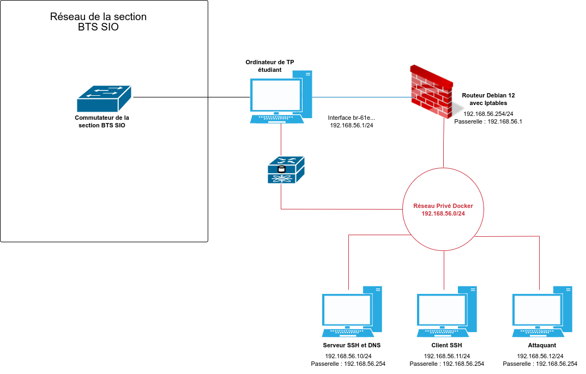

# Principes

## Activation du lab

Le script "active_lab1.sh" crée un laboratoire opérationnel (en créant le réseau et les 4 conteneurs pré-configurés) correspondant au réseau suivant :
.

Il est possible de personnaliser le laboratoire en modifiant les variables (fichier "variables).

## Images

4 images (opérationnelles) plus une image Debian de base.
Les images existent déjà sous l'id docker aporaf mais vous pouvez créer vos propres images avec le script create_image.sh, après avoir éventuellement modifié le fichier variables et les Dockerfile respectifs.

Usage du script create_image_lab1.sh :
create_images_lab1.sh -i ROUTEUR|SERVEUR|CLIENT|KALI|BASE

Prochainement:
create_image_lab1.sh -a permettra de créer toutes les images

### Image BASE

Basée sur Debian 12.
Intègre systemd (car le lab en a besoin)
Gère les locales française et le timezone Europe/Paris
Installe sudo et d'autres utilitaires
Lance SSH
Crée le compte non root utilisé dans le lab (par défaut etusio)

### Image CLIENT

### Image KALI

### Image ROUTEUR

### Image SERVEUR

## Conteneurs

### Conteneur CLIENT

### Conteneur KALI

### Conteneur ROUTEUR

### Conteneur SERVEUR