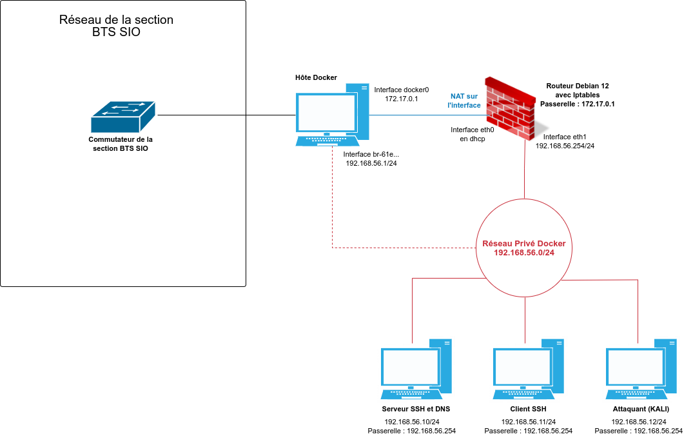

# Principes

## Gestion du lab

Sur un poste où Docker est installé :

1. Récupérer les scripts via git clone (git clone <https://forge.aeif.fr/btssio-labos-kali/lab1.git>).
1. Se déplacer dans le dossier "lab1" créé.
1. Usage du script "gestion_lab1.sh" :

``` bash
    Usage: bash gestion_lab1.sh -c|-l|d|s|r|i <type de l'image>|h
    -c Crée le laboratoire. Ce dernier sera lancé à l'issue de la création.
    -l Lance un laboratoire préalablement stoppé.
    -d Supprime le laboratoire. Les volumes sont également supprimés.
    -s Stoppe le laboratoire.
    -r Redémarre un laboratoire actif.
    -i Crée une image personnalisée (mettre le type de l'image en majuscule) -i ROUTEUR|SERVEUR|CLIENT|KALI|BASE.
    -h Détail des options.
```

> Il suffit de fournir le fichier gestion_lab1.sh aux étudiants.

Le script "gestion_lab1.sh" permet de créer un laboratoire opérationnel correspondant au schéma suivant :

.

> Il est possible de personnaliser le laboratoire en modifiant les variables.

## Accessibilité des conteneurs

### SSH

Tous les conteneurs sont accessibles via ssh à partir de l'hôte et de l'extérieur.

À partir de l'hôte les conteneurs sont directement accessibles via leur adresse IP interne sur le port 22, par exemple pour l'attaquant Kali : ssh etusio@192.168.56.12

À partir d'une machine externe les conteneurs sont accessibles via l'adresse IP de l'hôte sur le port défini dans le fichier variables, par exemple pour l'attaquant Kali : ssh etusio@192.168.60.111 -p 32222 (avec 192.168.60.111 l'adresse IP du serveur Docker).

### Interface graphique via RDP

Les conteneurs correspondants aux clients légitimes et à l'attaquant Kali sont dotés d'une interface graphique accessible via le protocole RDP.

Il est nécessaire de configurer un client de bureau à distance.

À partir de l'hôte les conteneurs sont directement accessibles via leur adresse IP interne sur le port 3389.

À partir d'une machine externe les conteneurs sont accessibles via l'adresse IP de l'hôte sur le port défini dans le fichier variables, par exemple pour l'attaquant Kali : 33389.

> Pour le client REMMINA (sur Linux), une configuration supplémentaire doit être faite :
>
> - ouvrir les paramètres de connexion pour le profil de connexion ;
> - accéder à "Avancé" et sélectionner "Cache des glyphes" et "Assouplir les vérifications des ordres".

## Génération des images

Il y a 4 images opérationnelles plus une image Debian 12 de base.

Les images existent déjà sur le Docker Hub sous l'id docker "reseaucerta" mais vous pouvez créer vos propres images après avoir éventuellement modifié les "variables" et les Dockerfile respectifs

Elles sont très légères :

```
REPOSITORY               TAG       SIZE
reseaucerta/routeurdebian12   lab1      425MB
reseaucerta/serveurdebian12   lab1      424MB
reseaucerta/clientdebian12    lab1      1.32GB
reseaucerta/kalirolling       lab1      2.39GB
reseaucerta/basedebian12      1.0       421MB
```

Pour créer une image personnalisée (après avoir modifié les variables nécessaires) :

`gestion_lab1.sh -i ROUTEUR|SERVEUR|CLIENT|KALI|BASE`


### Image BASE (fichier dockerfile_BASE)

- Basée sur Debian 12.
- Intègre systemd (car le lab en a besoin).
- Gère les locales française et le timezone Europe/Paris.
- Installe sudo et d'autres utilitaires.
- Lance SSH.
- Crée le compte "non root" utilisé dans le lab (par défaut etusio).

### Image CLIENT (fichier dockerfile_CLIENT)

- Basée sur l'image de base.
- Ajoute l'installation de XFCE4 et de XRDP.
- Ajoute également l'installation de Wireshark et de Firefox.

### Image KALI (fichier dockerfile_KALI)

- Basée sur kalilinux/kali-rolling.
- Intègre XFCE4 et XRDP.
- Intègre les meta-paquets "core" par défaut (le script de création de l'image permet d'intégrer n'importe quel meta-paquets).
- Intègre systemd.
- Gère les locales françaises et la timezone Europe/Paris.
- Installe sudo et d'autres outils nécessaire aux TP du labo ainsi que Wireshark et Firefox.
- Lance SSH.
- Crée le compte "non root" utilisé dans le lab (par défaut "etusio").
- Intègre ssh-mitm.

### Image ROUTEUR (fichier dockerfile_ROUTEUR)

- Basée sur l'image de base.
- Ajoute l'installation d'iptables et de conntrack (non indispensable mais permet un éventuel débogage).
- La configuration est réalisée lors de la création des conteneurs.

### Image SERVEUR (fichier dockerfile_SERVEUR)

- Basée sur l'image de base.
- Ajoute l'installation de bind9.
- Configure le serveur DNS.
- Les éléments de configuration sont basés sur l'adresse IP proposée dans le lab : 192.168.56.0/24.

## Génération des conteneurs

Voir les commentaires dans le fichier "gestion_lab1.sh".
